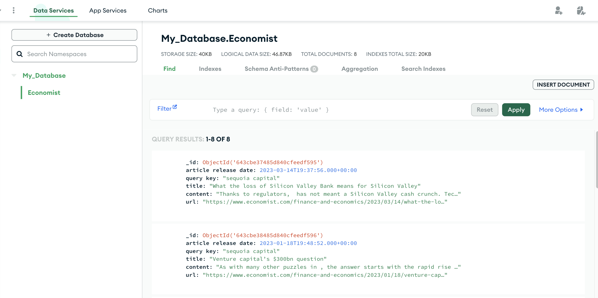

# Scrape Economists Articles with Scrapy
This project encompasses the automation of web scraping utilizing Scrapy, 
shell scripting, and the cron job scheduler.
Our primary objective is to efficiently extract pertinent articles from The Economist,
concentrating on specific search queries such as 'Sequoia Capital'.

To accomplish this, we design individual spiders for each search query 
and subsequently leverage shell scripting and the cron job scheduler to facilitate
the automatic execution of our spiders. 
This streamlined process ensures the consistent updating
of scraped results to the MongoDB Cloud on a weekly basis.
In addition, we have implemented a feature that sends email notifications 
when the weekly scraping process commences.

Taking into account the article publication frequency within The Economist,
we have strategically opted to maintain the relevancy of our search results 
by updating them every week. 
Consequently, the spider will cease its search upon encountering 
the first article published more than seven days prior
and subsequently return from the parse function. 
This approach guarantees the timely and accurate retrieval of data pertinent to our interests.


Key Features of this project:

- Custom Scrapy spiders for targeted article scraping
- Integration with MongoDB Cloud for efficient data storage
- Shell scripting for spider execution automation
- Cron job scheduling for automatic weekly updates
- Email notifications on scraping process completion

## 1 Notes Before Running the Spider
Scrapy processes requests asynchronously, which means that the order in which the output file 
is written may not correspond to the order in which the links appear on the webpage. 
If you need to use the scraped data in time order, 
you may need to perform additional sorting or ordering in the output database.

## 2 Explanation on Spiders

The spiders form the foundation of a scrapy project and reside in the [./scrape_economist/spiders](./scrape_economist/spiders) directory. 
These spiders allow us to tailor our web scraping approach for each website.
A specific spider, sequoia_capital.py, will be elaborated on as an example.

### sequoia_capital.py
Here we decide to use the crawl template instead of the basic template,
which provides additional functionality for more advanced crawling scenarios, 
such as following links and applying rules for URL extraction. 

To create this spider, we can simply write: 
`scrapy genspider -t crawl sequoia_capital www.economist.com` 
in the command line. 

Including a complete URL in the initial command, such as 
`scrapy genspider -t crawl Andreessen_Horowitz ‘www.economist.com/search?q=sequoia+capital&sort=date`, 
can potentially result in an error due to the presence of special characters in the URL.

After creating the spider, we can edit the start_urls attribute in the generated Python file
to include the search URL with the query parameters.

You can check the code [here](./scrape_economist/spiders/sequoia_capital.py). 
Our spider aims to gather the latest articles regarding sequoia capital. 
Fortunately, the website features a "sort by date" button that we can use. 
Upon clicking it, we observed that the only modification to the URL is the addition of "&sort=date" at the end. 
As a result, we made a simple adjustment to the start URL, which is now: 
https://www.economist.com/search?q=sequoia+capital&sort=date.

In order to implement pagination and terminate the web scraping process upon finding
the first article with a release date prior to our specified date (for instance 7 days), 
we employ the following approach: we modify the rules by
halting the process of following the next page as soon as 
we encounter the first article that is more than 7 days old.

More specifically, when we determine that 
`now_aware - article_date <= timedelta(days=7)`
is false, we will execute the following command to modify rules: 
`rules = rules[:1]`. This will alter rules from

    rules = (
        # Rule to follow the links to the news articles
        Rule(LinkExtractor(restrict_xpaths="//li[@class='_result-item']/div/a"), callback="parse_item", follow=True),
        # Rule to follow the next page link
        Rule(LinkExtractor(restrict_xpaths="(//a[@rel='next'])[1]")),
    )

to 

    rules = (
        # Rule to follow the links to the news articles
        Rule(LinkExtractor(restrict_xpaths="//li[@class='_result-item']/div/a"), callback="parse_item", follow=True),
    )
This tells the algorithm not to go to the next page afterward.

Besides, one issue we are facing is that when we execute requests in the Scrapy shell, we successfully obtain the
desired content. However, when we use a spider, we run into a `DEBUG: Forbidden by robots.txt` error. 
At first we thought this may be due to the fact that the Scrapy shell doesn't store cookies or sessions between requests,
while a spider does. As a result, we have decided to try disabling the COOKIES_ENABLED setting
in the spider's settings by using the following command: 
`custom_settings = {'COOKIES_ENABLED': False,}`. However, this doesn't work. 

So we decide to modify the settings.py by adding: `ROBOTSTXT_OBEY = False`. However, we need to be 
cautious while using this setting and ensure you are respecting the website's terms of service and privacy policies.
You can try different approaches to solve this problem in your own spiders.

## 3 How to Run Spiders and Store the scraping results in Different Locations?
The storage location of the web scraping output can be determined based on the size of the results; 
it can either be stored locally or in the cloud.

### Store Scraping Results Locally
On certain occasions, we may need to perform local testing and store the scraped data locally. 
To accomplish this, we can execute a command in the terminal, such as the following:

`scrapy crawl sequoia_capital -o output_data_local/sequoia_capital.csv`

By running this command, we can run the spider named "sequoia_capital"
and store the scraped data in the "output_data" folder [here](./output_data_local/sequoia_capital.csv) in csv format.
This CSV file contains four columns:

```csv
article release date, query key, title, content, url
```
In this context, the term "release date" refers to the date on which the article is published in The Economist. 
The "query key" denotes the search query utilized during web scraping to retrieve information related to an investor's name. 
The "title" pertains to the title of the article, while the "content" refers to the complete article text. 
Lastly, the "url" indicates the web address where the article is located.

As the articles relevant to Sequoia Capital in The Economist are not updated frequently, 
for the purposes of this demonstration CSV file, 
I have gathered all articles related to Sequoia Capital published within 365 days 
before April 17, 2023, by altering the following line in [sequoia_capital.py](./scrape_economist/spiders/sequoia_capital.py):

`if now_aware - article_date <= timedelta(days=365)` 

Naturally, if we wish to update our database on a weekly basis in the future, 
we can revert the aforementioned line back to:

`if now_aware - article_date <= timedelta(days=7)`.

### Store the Scraping Results in Cloud Database
If we want to store data remotely, we need to modify the [pipeline.py](./scrape_economist/pipelines.py)
 and [settings.py](./scrape_economist/settings.py).

#### pipelines.py
For instance, if we want to store our scraping results in Mongodb, 
we can implement a class `MongodbPipeline`. Inside this class, 
we implement 3 functions:  `open_spider()` (which runs before spider starts); 
`close_spider()` (which runs after spider starts);
`process_item()` (which load output to the Mongodb cloud).
As we can see from the code, the output will be stored at My_database.Economist
directory in the cloud. 

#### settings.py
In order to save the output obtained from sequoia_capital.py to the Mongodb cloud, 
it is also necessary to both comment out the line containing "ITEM_PIPELINES" 
in the file and modify it to 
"ITEM_PIPELINES = {"scrapy_trial.pipelines.MongodbPipeline": 300, },"
so that it matches the class name in pipelines.py.

#### Mongodb Cloud
This is a demonstration of the way data is stored in a MongoDB cloud database:


It should be noted that occasional errors may occur, such as the following:
`pymongo.errors.ServerSelectionTimeoutError: localhost:27017: [Errno 61] Connection refused`
To address this issue, we might need to manually start mongodb beforehand by:

`brew services start mongodb-community@6.0`   

To learn how to install mongodb on Apple M1 using Homebrew, you can refer to [this resource](https://stackoverflow.com/questions/65357744/how-to-install-mongodb-on-apple-m1-chip).

## 5 Automatically Running Spiders
To automate the execution of our spider and update our database on a weekly basis, 
we can use a combination of a shell script and the Cron job scheduler.

### Shell Script
I provide 2 version of shell script. The advanced one can be found [here](./scrape_economist/run_spider_advanced.sh).
Essentially, it enables intended conda environment and runs all spiders in that environment. 
Additionally, it has the capability to log execution details with timestamps
and send email notifications upon completion of the scraping process.


To manually execute the script, navigate to its directory and enter the command `bash run_spider_complex.sh`.

Note that by default cron jobs are executed from the user's home directory. 
Hence, the use of relative paths in shell script could be a common cause of cron issues.
In this case, we use absolute path in the shell script.

### Cron Job Scheduler
To use a cron job scheduler to execute a bash shell script weekly, we can follow below steps:
#### step 1
Give the script execute permissions using the chmod command: 

`chmod +x run_spider_advanced.sh`

#### step 2
Open the crontab editor with `crontab -e` and add a new cron job:

`* * * * * /path/to/your/script.sh`

The first 5 fields (separated by spaces) represent 
minutes (0-59), hours (0-23), days of the month (1-31), months (1-12), and days of the week (0-7, where both 0 and 7 represent Sunday).

My default is vi, and below are steps how I can modify my crontab files:
- Press i to enter insert mode, which allows you to edit the file
- Navigate the file using the arrow keys and modify the lines as needed
- Press Esc to exit insert mode
- Save and exit the file by typing :wq followed by Enter

Your default text editor could be nano, vim, or vi, each with different methods to edit and save files.

For instance, in my computer, my setting would be

`1 0 * * 1 /Users/zhanghanyuan/PycharmProjects/scrape_economist/scrape_economist/run_spider_script.sh`

This enables automatically running the script every Monday at 0:01 AM

Finally, we can save and exit the file. Later when you want to check your job, you can simply typing `crontab -l`

## 7 Conclusion
That's pretty much end of it. Hope this readme file can help you better understand the code.


